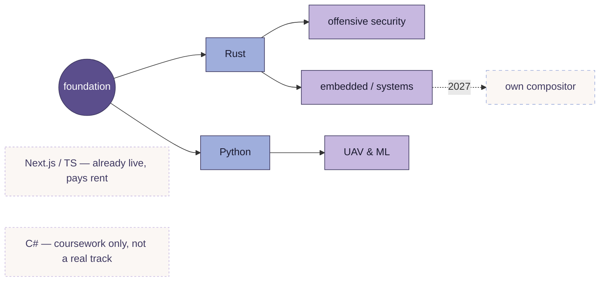

<div align="center">


<a href="https://git.io/typing-svg">
  
</a>

<br/><br/>

<a href="https://github.com/volkansync">
  
</a>
&nbsp;
<a href="https://www.linkedin.com/in/volkan-%C3%A7evik-90b1a937a">
  
</a>
&nbsp;
<a href="https://www.youtube.com/@volkansync">
  
</a>

<br/><br/>
</div>


<div align="center">

### `[ DOCTRINE ]`

> *"Waste no more time arguing about what a good man should be. Be one."*
> — Marcus Aurelius

> Nobody handed me the path. I'm cutting it myself, in the dark, before anyone's watching.

> Power that needs an audience isn't power yet.

<details>
<summary><sub>why this page looks like this</sub></summary>
<br/>

Deleted every account that wasn't building toward something. This page updates when something real changes underneath it — a language learned, a system shipped — not on a posting schedule. If you're reading this far, you already know it's not for an audience.

</details>

</div>

---

<div align="center">

### `[ OPERATOR ]`

<table>
<tr>
<td align="center" width="50%">

```
USER     →  volkansync
BASE     →  Eskişehir, TR
OS       →  Arch / Wayfire
SHELL    →  zsh + neovim
STATUS   →  forging, not performing
```

</td>
<td align="center" width="50%">

| PID | PROCESS | STATE |
|-----|---------|-------|
| 01 | `rust_forge` | 🟢 running |
| 02 | `python_uav_ml` | 🟢 running |
| 03 | `web_studio.agency` | 🟡 live, scaling |
| 04 | `quickshell_ritual` | 🟡 building |
| 05 | `own_compositor` | ⚪ queued — 2027 |

</td>
</tr>
</table>

</div>


<div align="center">

### `[ ARSENAL ]`

**battlefield — what pays the bills**


**forge — what's being built**


| track | domain | state |
|---|---|---|
| `Rust` | offensive security / embedded | ░░░░░░░░░░ 0% |
| `Python` | UAV & ML | ░░░░░░░░░░ 3% |
| `C#` | coursework only | ░░░░░░░░░░ 2% |
| `Next.js / TS` | client work, daily driver | ▓▓▓▓░░░░░░ 35% |

</div>


<div align="center">

### `[ ROADMAP ]`



<sub>not a skill list — this is the actual branch plan, updated as it changes</sub>

</div>

---

<div align="center">

### `[ METRICS ]`

<a href="https://github.com/volkansync">
  
</a>
<a href="https://github.com/volkansync">
  
</a>

<br/><br/>

<a href="https://git.io/streak-stats">
  
</a>

</div>

---

<div align="center">

### `[ CONTRIBUTION TRAIL ]`

<picture>
  <source media="(prefers-color-scheme: dark)" srcset="https://raw.githubusercontent.com/volkansync/volkansync/output/github-contribution-grid-snake-dark.svg" />
  <source media="(prefers-color-scheme: light)" srcset="https://raw.githubusercontent.com/volkansync/volkansync/output/github-contribution-grid-snake.svg" />
  
</picture>

</div>

---

<div align="center">
<a href="https://github.com/volkansync">
  
</a>
</div>

---

<div align="center">

```zsh
volkan@taraxacum:~$ echo "The obstacle is the way."
→  The obstacle is the way.
volkan@taraxacum:~$ ./forge.sh --witnesses none --stop never
→  running in silence...
```


</div>
