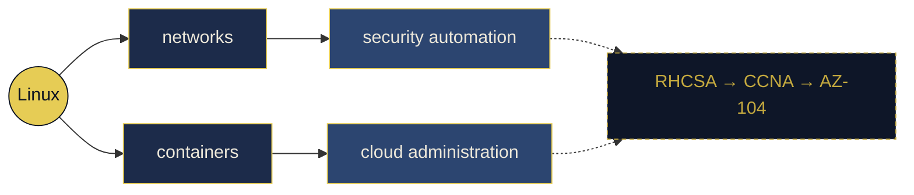

<div align="center">

<a href="https://git.io/typing-svg">
  
</a>


<a href="https://github.com/volkansync/field-notes"></a>
<a href="https://www.linkedin.com/in/volkan-%C3%A7evik-90b1a937a"></a>
<a href="https://www.youtube.com/@volkansync"></a>


</div>


<table>
<tr>
<td width="56%" valign="top">

```
◆  volkansync
   systems · infrastructure · security

▸  BASE    Eskişehir, TR
▸  OS      Arch / Wayland
▸  SHELL   zsh + neovim
▸  METHOD  eliminate → measure → fix

   "it works now" is not an explanation.
```

</td>
<td width="44%" valign="top">

| ◆ | TRACK | STATE |
|---|---|---|
| `01` | **field-notes** | 🟡 001 of 04 |
| `02` | **homelab** | 🟢 running |
| `03` | mobile product | 🟠 pre-release |
| `04` | **deutsch → B1** | 🟢 daily |
| `05` | RHCSA / LFCS | ⚪ queued |

</td>
</tr>
</table>


<div align="center"><h3><code>◆ CASEFILES</code></h3><sub>most of the work is ruling things out</sub></div>

<br/>

<table>
<tr>
<td width="52%" valign="top">

> ### 🔴 `CASE 001`
> **Bluetooth audio dropping out**
> <sub>one channel first, alternating · two different headsets</sub>
>
> ~~faulty headphones~~ ~~wrong codec~~ ~~"just use 5 GHz"~~
>
> **→ 2.4 GHz band contention**
> <sub>power saving amplifies it · the link must be renegotiated</sub>
>
> # `152.5 → 18.3`
> <sub>failures/day · same network · **10 days at zero**</sub>

</td>
<td width="48%" valign="top">

**`CASE 002` · TLS certificate errors**
~~clock~~ ~~CA bundle~~ ~~the certificate~~
**→ ISP-level DNS blocking**
<sub>the resolution path, never the crypto</sub>

<br/>

**`CASE 003` · Anti-cheat 60099**
~~reinstall~~ ~~prefix reset~~
**→ `tr_TR` locale + missing font**
<sub>documented — survives the next reset</sub>

<br/>

**`CASE 004` · Shell dies every upgrade**
~~reinstall the package~~
**→ Qt ABI break**
<sub>found the trigger, not the symptom</sub>

<br/>

<sub>◆ full writeups + data + code →<br/>**[field-notes](https://github.com/volkansync/field-notes)**</sub>

</td>
</tr>
</table>


<table>
<tr>
<td width="38%" valign="top">

<div align="center">

<h3><code>◆ INSTRUMENTS</code></h3>


</div>

`bt-dropout-test.sh`
<sub>2×2 harness · restores state on `Ctrl+C`</sub>

`analiz.py` ⚠️
<sub>**kept because it was wrong** — circular denominator</sub>

`analiz3.py` ✓
<sub>the one that held</sub>

</td>
<td width="62%" valign="top">



</td>
</tr>
</table>


<div align="center">

<a href="https://github.com/volkansync"></a>
<a href="https://github.com/volkansync"></a>

<picture>
  <source media="(prefers-color-scheme: dark)" srcset="https://raw.githubusercontent.com/volkansync/volkansync/output/github-contribution-grid-snake-dark.svg" />
  
</picture>

<a href="https://github.com/volkansync"></a>

<br/>

<details>
<summary><sub><code>◆ CASE LOG</code> — expensive decisions, kept even when they read badly later</sub></summary>
<br/>

| | decision | why |
|---|---|---|
| `2026-09` | Closed the web agency; one product only | No revenue, fixed costs compounding |
| `2026-09` | Nothing new ships until the current one does | 18 categories scanned — a maintained free competitor in **every one** |
| `2026-09` | Deterministic by default; AI optional | When the credit runs out, it still has to work |
| `2026-09` | One repo, one deploy, one DB per product | A failure in one can't take down another |
| `2026-07` | Wayfire over Hyprland · Quickshell over Astal | Plugin architecture over polish |
| `2026-07` | C# scoped to coursework | Deliberately outside the real track |

</details>

<br/>

```
◆  "When you have eliminated the impossible, whatever remains,
    however improbable, must be the truth."

                                    → and then you measure it.
```

</div>
